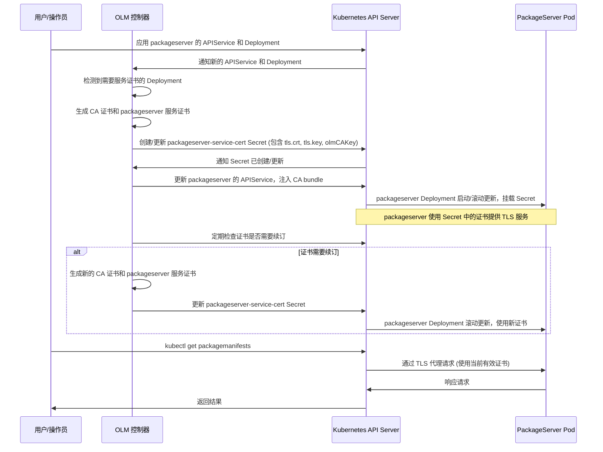
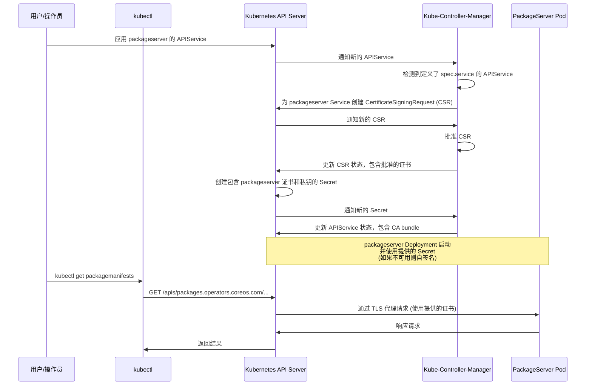

# packageserver 服务证书管理分析

本文档分析了 `operator-framework-olm` 项目中 packageserver 服务证书的管理方式、创建、更新、使用场景以及过期时间。

## 发现总结

1.  在当前的 `manifests` 和 `microshift-manifests` 目录中，没有找到名为 `packageserver-service-cert` 的静态 Secret 资源。
2.  OLM 会动态创建一个名为 `[service-name]-cert` 的 Secret 来存储 packageserver 的服务证书，对于 packageserver，这个 Secret 的名称通常是 `packageserver-service-cert`。这个 Secret 中包含了 CA 证书，其数据字段的 key 为 `olmCAKey`。
3.  在 `staging/operator-lifecycle-manager/deploy/upstream/manifests/0.7.x` 目录下的旧版本 manifest 中，明确定义了一个名为 `package-server-certs` 的 `Secret` 资源，类型为 `kubernetes.io/tls`。这个 Secret 包含了 base64 编码的证书和私钥，并被挂载到 packageserver 的 Deployment 中。
4.  packageserver 的 Go 代码 (`pkg/package-server/server/server.go`) 使用了 `k8s.io/apiserver/pkg/server/options.SecureServingOptionsWithLoopback` 并调用了 `MaybeDefaultWithSelfSignedCerts`。这表明 packageserver 配置了 TLS，并且具备在没有外部证书提供时生成自签名证书的能力。
5.  项目中包含了与 packageserver 相关的 `APIService` 定义（在旧版本 manifest 中找到，并通过搜索 `kind: APIService` 确认）。Kubernetes Aggregated API Server 通常依赖 Kubernetes 平台来提供和管理 TLS 证书，通常通过 `certificates.k8s.io` API。
6.  虽然 Kubernetes `certificates.k8s.io` API 的类型 (`CertificateSigningRequest`) 存在于 vendor 目录中，但尚未在 OLM 内部找到明确的代码，用于主动创建或管理专门用于 packageserver 服务证书的 `CertificateSigningRequest` 资源。

## 管理、创建和更新

对 `packageserver-service-cert` Secret 的管理、创建和更新逻辑主要存在于 OLM 自身的源代码中，这部分代码在本仓库的 `vendor/github.com/operator-framework/operator-lifecycle-manager` 目录下。

在 OLM 的旧版本中 (例如 `staging/operator-lifecycle-manager/deploy/upstream/manifests/0.7.0/22-packageserver.yaml`)，TLS 证书和私钥是通过一个静态的 Kubernetes `Secret` 资源来管理的：

```yaml
apiVersion: v1
kind: Secret
type: kubernetes.io/tls
metadata:
  name: package-server-certs
  namespace: kube-system
  labels:
    app: package-server
data:
  tls.crt: "LS0tLS1CRUdJTi..." # Base64 编码的证书
  tls.key: "LS0tLS1CRUdJTi..." # Base64 编码的私钥
```

然后这个 Secret 被挂载到 packageserver 的 Deployment 中：

```yaml
      volumes:
      - name: certs
        secret:
          secretName: package-server-certs
          items:
          - key: tls.crt
            path: apiserver.crt
          - key: tls.key
            path: apiserver.key
```

相应的 `APIService` 引用了这个证书的 CA bundle：

```yaml
apiVersion: apiregistration.k8s.io/v1beta1
kind: APIService
metadata:
  name: v1alpha1.packages.apps.redhat.com
spec:
  caBundle: "LS0tLS1CRUdJTi..." # Base64 编码的 CA bundle
  # ...
```

在当前的架构中，OLM 会动态创建和管理 packageserver 的服务证书 Secret。根据 `staging/operator-lifecycle-manager/pkg/controller/install/certresources.go` 中的逻辑，OLM 会为 packageserver Service (通常名称为 `packageserver-service`) 创建一个名为 `packageserver-service-cert` 的 Secret。这个 Secret 的类型是 `kubernetes.io/tls`，并且包含以下数据字段：
- `tls.crt`: packageserver 的服务证书。
- `tls.key`: packageserver 的私钥。
- `olmCAKey`: 用于签署服务证书的 CA 证书。

OLM 会生成 CA 证书和由该 CA 签名的服务证书。

### OLMCAPEMKey 的含义

在 `staging/operator-lifecycle-manager/pkg/controller/install/certresources.go` 中，`OLMCAPEMKey` 被定义为一个常量：

```go
const (
	// DefaultCertMinFresh is the default min-fresh value - 1 day
	DefaultCertMinFresh = time.Hour * 24
	// DefaultCertValidFor is the default duration a cert can be valid for - 2 years
	DefaultCertValidFor = time.Hour * 24 * 730
	// OLMCAPEMKey is the CAPEM
	OLMCAPEMKey = "olmCAKey"
	// ...
)
```

这个常量 `OLMCAPEMKey` 的值为字符串 `"olmCAKey"`。它在 OLM 动态创建 packageserver 服务证书 Secret 时被用作 Secret 的 `data` 字段中的一个键，用于存储 OLM 生成的 CA 证书的 PEM 格式数据。这个 CA 证书是 OLM 用来签署 packageserver 服务证书的根证书。

相关的代码片段如下 (`staging/operator-lifecycle-manager/pkg/controller/install/certresources.go`)：

```go
	// Create the CA
	i.certificateExpirationTime = CalculateCertExpiration(time.Now())
	ca, err := certs.GenerateCA(i.certificateExpirationTime, Organization)
	if err != nil {
		logger.Debug("failed to generate CA")
		return nil, err
	}

	// ...

	// Create signed serving cert
	hosts := HostnamesForService(serviceName, i.owner.GetNamespace())
	servingPair, err := certGenerator.Generate(expiration, Organization, ca, hosts)
	if err != nil {
		logger.Warnf("could not generate signed certs for hosts %v", hosts)
		return nil, nil, err
	}

	// Create Secret for serving cert
	certPEM, privPEM, err := servingPair.ToPEM()
	if err != nil {
		logger.Warnf("unable to convert serving certificate and private key to PEM format for Service %s", serviceName)
		return nil, nil, err
	}

	// Add olmcahash as a label to the caPEM
	caPEM, _, err := ca.ToPEM()
	if err != nil {
		logger.Warnf("unable to convert CA certificate to PEM format for Service %s", serviceName)
		return nil, nil, err
	}
	caHash := certs.PEMSHA256(caPEM)

	annotations := map[string]string{
		OpenShiftComponent:     OLMOwnershipAnnotation,
		OLMCAHashAnnotationKey: caHash,
	}

	secret := &corev1.Secret{
		Data: map[string][]byte{
			"tls.crt":   certPEM,
			"tls.key":   privPEM,
			OLMCAPEMKey: caPEM, // olmCAKey is defined as OLMCAPEMKey constant
		},
		Type: corev1.SecretTypeTLS,
	}
	secret.SetName(SecretName(serviceName)) // SecretName generates name like serviceName + "-cert"
	secret.SetNamespace(i.owner.GetNamespace())
	secret.SetLabels(map[string]string{OLMManagedLabelKey: OLMManagedLabelValue})
	secret.SetAnnotations(annotations)

	// ... logic to create or update the secret ...
```

这个动态生成的 Secret 会被挂载到 packageserver 的 Deployment 中，以便 packageserver 使用该证书提供 TLS 服务。相关的代码片段如下 (`staging/operator-lifecycle-manager/pkg/controller/install/certresources.go`)：

```go
func AddDefaultCertVolumeAndVolumeMounts(depSpec *appsv1.DeploymentSpec, secretName string) {
	// Update deployment with secret volume mount.
	volume := corev1.Volume{
		Name: "apiservice-cert",
		VolumeSource: corev1.VolumeSource{
			Secret: &corev1.SecretVolumeSource{
				SecretName: secretName, // secretName is the dynamically generated secret name
				Items: []corev1.KeyToPath{
					{
						Key:  "tls.crt",
						Path: "apiserver.crt",
					},
					{
						Key:  "tls.key",
						Path: "apiserver.key",
					},
				},
			},
		},
	}

	mount := corev1.VolumeMount{
		Name:      volume.Name,
		MountPath: "/apiserver.local.config/certificates",
	}

	addCertVolumeAndVolumeMount(depSpec, volume, mount)

	// ... webhook cert volume mount ...
}
```

OLM 控制器负责监控证书的过期时间，并在证书接近过期时自动续订。续订逻辑在 `shouldRotateCerts` 函数中实现，它检查证书是否过期、无效或在最小新鲜度间隔内。如果需要续订，OLM 会生成新的证书和私钥，并更新 Secret。这会导致 packageserver Pod 的滚动更新，以便使用新的证书。

相关的代码片段如下 (`staging/operator-lifecycle-manager/pkg/controller/install/certresources.go`)：

```go
const (
	// DefaultCertMinFresh is the default min-fresh value - 1 day
	DefaultCertMinFresh = time.Hour * 24
	// DefaultCertValidFor is the default duration a cert can be valid for - 2 years
	DefaultCertValidFor = time.Hour * 24 * 730
	// ...
)

func CalculateCertExpiration(startingFrom time.Time) time.Time {
	return startingFrom.Add(DefaultCertValidFor)
}

func CalculateCertRotatesAt(certExpirationTime time.Time) time.Time {
	return certExpirationTime.Add(-1 * DefaultCertMinFresh)
}

// shouldRotateCerts indicates whether an apiService cert should be rotated due to being
// malformed, invalid, expired, inactive or within a specific freshness interval (DefaultCertMinFresh) before expiry.
func shouldRotateCerts(certSecret *corev1.Secret, hosts []string) bool {
	now := metav1.Now()
	caPEM, ok := certSecret.Data[OLMCAPEMKey]
	if !ok {
		// missing CA cert in secret
		return true
	}
	certPEM, ok := certSecret.Data["tls.crt"]
	if !ok {
		// missing cert in secret
		return true
	}

	ca, err := certs.PEMToCert(caPEM)
	if err != nil {
		// malformed CA cert
		return true
	}
	cert, err := certs.PEMToCert(certPEM)
	if err != nil {
		// malformed cert
		return true
	}

	// check for cert freshness
	if !certs.Active(ca) || now.Time.After(CalculateCertRotatesAt(ca.NotAfter)) ||
		!certs.Active(cert) || now.Time.After(CalculateCertRotatesAt(cert.NotAfter)) {
		return true
	}

	// Check validity of serving cert and if serving cert is trusted by the CA
	for _, host := range hosts {
		if err := certs.VerifyCert(ca, cert, host); err != nil {
			return true
		}
	}
	return false
}

// ... logic to create or update secret based on shouldRotateCerts ...
```

## 使用场景

packageserver 在 Kubernetes 中被注册为一个 Aggregated API Server。TLS 证书用于保护 Kubernetes API Server 与 packageserver 之间的通信。当客户端 (如 `kubectl` 或其他控制器) 与 packageserver 的 API 交互时 (例如，列出 `PackageManifests`)，请求会通过 Kubernetes API Server，然后由 API Server 通过安全的 TLS 连接代理到 packageserver。`APIService` 资源中的 `caBundle` 允许 Kubernetes API Server 信任 packageserver 提供的证书。

## 过期时间

OLM 动态生成的服务证书默认有效期为 2 年 (`DefaultCertValidFor`)。OLM 控制器会监控证书的过期时间，并在证书过期前 1 天 (`DefaultCertMinFresh`) 触发续订。

## 时序图 (OLM 动态管理证书)



在 OLM 的旧版本中 (例如 `staging/operator-lifecycle-manager/deploy/upstream/manifests/0.7.0/22-packageserver.yaml`)，TLS 证书和私钥是通过一个静态的 Kubernetes `Secret` 资源来管理的：

```yaml
apiVersion: v1
kind: Secret
type: kubernetes.io/tls
metadata:
  name: package-server-certs
  namespace: kube-system
  labels:
    app: package-server
data:
  tls.crt: "LS0tLS1CRUdJTi..." # Base64 编码的证书
  tls.key: "LS0tLS1CRUdJTi..." # Base64 编码的私钥
```

然后这个 Secret 被挂载到 packageserver 的 Deployment 中：

```yaml
      volumes:
      - name: certs
        secret:
          secretName: package-server-certs
          items:
          - key: tls.crt
            path: apiserver.crt
          - key: tls.key
            path: apiserver.key
```

相应的 `APIService` 引用了这个证书的 CA bundle：

```yaml
apiVersion: apiregistration.k8s.io/v1beta1
kind: APIService
metadata:
  name: v1alpha1.packages.apps.redhat.com
spec:
  caBundle: "LS0tLS1CRUdJTi..." # Base64 编码的 CA bundle
  # ...
```

在当前的架构中，基于在主要 manifest 中没有找到这个静态 Secret，以及代码中存在 `SecureServingOptionsWithLoopback` 和 `MaybeDefaultWithSelfSignedCerts`，极有可能 packageserver 的 TLS 证书是在 packageserver 被注册为 Aggregated API Server 时，由 Kubernetes 平台动态提供的。这是 Aggregated API Server 的标准机制，Kubernetes 控制平面 (特别是 `kube-controller-manager`) 会监听定义了 `spec.service` 的 `APIService` 资源，并自动为指定的 Service 提供服务证书，将其存储在一个 `Secret` 中 (通常名称是自动生成的)，并将 CA bundle 注入到 `APIService` 的 status 中。

packageserver 代码中的自签名逻辑可能是平台证书提供不可用时的备用方案，或者用于特定的测试/开发环境。

## 使用场景

packageserver 在 Kubernetes 中被注册为一个 Aggregated API Server。TLS 证书用于保护 Kubernetes API Server 与 packageserver 之间的通信。当客户端 (如 `kubectl` 或其他控制器) 与 packageserver 的 API 交互时 (例如，列出 `PackageManifests`)，请求会通过 Kubernetes API Server，然后由 API Server 通过安全的 TLS 连接代理到 packageserver。`APIService` 资源中的 `caBundle` 允许 Kubernetes API Server 信任 packageserver 提供的证书。

## 过期时间

如果证书是由 Kubernetes 平台通过 `certificates.k8s.io` API 动态提供的，那么平台通常负责其生命周期，包括在过期前进行续订。具体的过期时间取决于 Kubernetes 集群的配置以及 `kube-controller-manager` 用于签署服务证书的 CA。如果 packageserver 回退到自签名证书，证书将有一个默认的过期时间 (通常为 1 年)，并且不会由平台自动续订。

## 时序图 (动态提供证书)


