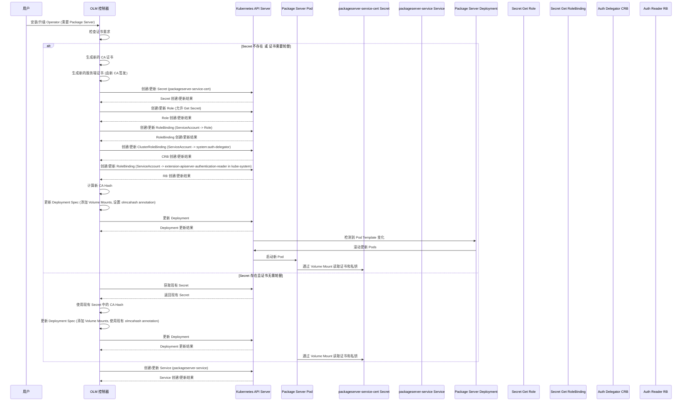

# Package Server 证书管理详解

本文档基于 `vendor/github.com/operator-framework/operator-lifecycle-manager/pkg/controller/install/certresources.go` 源代码，详细梳理 OLM 中 Package Server 服务证书 (`packageserver-service-cert`) 的管理方式、与 `olmCAKey` 的关系以及证书的更新和轮替逻辑。

## 证书名称与存储

Package Server 服务使用的 TLS 证书存储在一个 Kubernetes Secret 中，其名称通过 `SecretName` 函数生成，基于服务名称加上 `-cert` 后缀。对于 Package Server 服务 (`packageserver-service`)，Secret 的名称通常是 `packageserver-service-cert`。

```go
func SecretName(serviceName string) string {
	return serviceName + "-cert"
}

func ServiceName(deploymentName string) string {
	return deploymentName + "-service"
}
```

这个 Secret 类型是 `corev1.SecretTypeTLS`，它包含以下数据项：
- `tls.crt`: 服务端证书 PEM 格式。
- `tls.key`: 服务端私钥 PEM 格式。
- `olmCAKey`: 签发此服务端证书的 CA 证书 PEM 格式。

```go
	secret := &corev1.Secret{
		Data: map[string][]byte{
			"tls.crt":   certPEM,
			"tls.key":   privPEM,
			OLMCAPEMKey: caPEM,
		},
		Type: corev1.SecretTypeTLS,
	}
	secret.SetName(SecretName(serviceName))
	secret.SetNamespace(i.owner.GetNamespace())
	secret.SetLabels(map[string]string{OLMManagedLabelKey: OLMManagedLabelValue})
	secret.SetAnnotations(annotations)
```

其中，`OLMCAPEMKey` 是一个常量，定义在 `certresources.go` 中，其值为 `"olmCAKey"`。

```go
const (
	// ... other constants
	// OLMCAPEMKey is the CAPEM
	OLMCAPEMKey = "olmCAKey"
	// ... other constants
)
```

## 证书生成与关系

证书的生成发生在 `installCertRequirements` 和 `installCertRequirementsForDeployment` 函数中，通常在 OLM 安装或升级需要 APIService 或 Webhook 的 Operator 时触发。

1.  **CA 证书生成**: OLM 首先生成一个 CA 证书。这个 CA 证书是自签发的，有效期默认为 2 年 (`DefaultCertValidFor`)。

    ```go
    func (i *StrategyDeploymentInstaller) installCertRequirements(strategy Strategy) (*v1alpha1.StrategyDetailsDeployment, error) {
    	// ...
    	// Create the CA
    	i.certificateExpirationTime = CalculateCertExpiration(time.Now())
    	ca, err := certs.GenerateCA(i.certificateExpirationTime, Organization)
    	if err != nil {
    		logger.Debug("failed to generate CA")
    		return nil, err
    	}
    	// ...
    }

    func CalculateCertExpiration(startingFrom time.Time) time.Time {
    	return startingFrom.Add(DefaultCertValidFor)
    }
    ```

2.  **服务端证书生成**: 针对 Package Server 部署对应的 Service (`packageserver-service`)，OLM 使用上述生成的 CA 证书签发一个服务端证书。服务端证书的 Common Name 和 Subject Alternate Names (SANs) 包含服务的各种形式的 DNS 名称（如 `packageserver-service.<namespace>`, `packageserver-service.<namespace>.svc`, `packageserver-service.<namespace>.svc.cluster.local`）。

    ```go
    func (i *StrategyDeploymentInstaller) installCertRequirementsForDeployment(deploymentName string, ca *certs.KeyPair, expiration time.Time, depSpec appsv1.DeploymentSpec, ports []corev1.ServicePort) (*appsv1.DeploymentSpec, []byte, error) {
    	// ...
    	// Create signed serving cert
    	serviceName := ServiceName(deploymentName)
    	hosts := HostnamesForService(serviceName, i.owner.GetNamespace())
    	servingPair, err := certGenerator.Generate(expiration, Organization, ca, hosts)
    	if err != nil {
    		logger.Warnf("could not generate signed certs for hosts %v", hosts)
    		return nil, nil, err
    	}
    	// ...
    }

    func HostnamesForService(serviceName, namespace string) []string {
    	return []string{
    		fmt.Sprintf("%s.%s", serviceName, namespace),
    		fmt.Sprintf("%s.%s.svc", serviceName, namespace),
    		fmt.Sprintf("%s.%s.svc.cluster.local", serviceName, namespace),
    	}
    }
    ```
    这个服务端证书和私钥以及用于签发它的 CA 证书一起存储在 `packageserver-service-cert` Secret 中。因此，`packageserver-service-cert` Secret 包含了服务端证书、私钥以及其对应的 CA 证书 (`olmCAKey`)。

## 证书更新与轮替逻辑

OLM 会检查现有的 `packageserver-service-cert` Secret，并根据需要进行证书轮替。轮替的判断逻辑在 `shouldRotateCerts` 函数中实现：

```go
func shouldRotateCerts(certSecret *corev1.Secret, hosts []string) bool {
	now := metav1.Now()
	caPEM, ok := certSecret.Data[OLMCAPEMKey]
	if !ok {
		// missing CA cert in secret
		return true
	}
	certPEM, ok := certSecret.Data["tls.crt"]
	if !ok {
		// missing cert in secret
		return true
	}

	ca, err := certs.PEMToCert(caPEM)
	if err != nil {
		// malformed CA cert
		return true
	}
	cert, err := certs.PEMToCert(certPEM)
	if err != nil {
		// malformed cert
		return true
	}

	// check for cert freshness
	if !certs.Active(ca) || now.Time.After(CalculateCertRotatesAt(ca.NotAfter)) ||
		!certs.Active(cert) || now.Time.After(CalculateCertRotatesAt(cert.NotAfter)) {
		return true
	}

	// Check validity of serving cert and if serving cert is trusted by the CA
	for _, host := range hosts {
		if err := certs.VerifyCert(ca, cert, host); err != nil {
			return true
		}
	}
	return false
}
```

证书轮替的条件包括：
- Secret 中缺少 `olmCAKey` 或 `tls.crt` 数据。
- CA 证书或服务端证书格式错误。
- CA 证书或服务端证书已过期，或者距离过期时间少于 `DefaultCertMinFresh` (默认为 1 天)。`CalculateCertRotatesAt` 函数计算出证书需要轮替的时间点，即过期时间减去 `DefaultCertMinFresh`。
- 服务端证书对于预期的 hosts 无效，或者不被 Secret 中存储的 CA 证书信任。

如果 `shouldRotateCerts` 返回 `true`，或者 `packageserver-service-cert` Secret 不存在，OLM 将生成新的 CA 和服务端证书，并更新或创建 Secret。

更新 Secret 后，OLM 会在 Package Server 部署的 Pod 模板中设置 `olmcahash` annotation。这个 annotation 的值是新 CA 证书的 SHA256 哈希。Kubernetes 检测到 Pod 模板的 annotation 变化后，会触发 Deployment 的滚动更新，从而确保新的 Pod 使用包含新证书的 Secret。

```go
	// Add olmcahash as a label to the caPEM
	// ...
	caHash := certs.PEMSHA256(caPEM)

	annotations := map[string]string{
		OpenShiftComponent:     OLMOwnershipAnnotation,
		OLMCAHashAnnotationKey: caHash,
	}
	// ...
	secret.SetAnnotations(annotations)
	// ...
	// Setting the olm hash label forces a rollout and ensures that the new secret
	// is used by the apiserver if not hot reloading.
	SetCAAnnotation(&depSpec, caHash)
	return &depSpec, caPEM, nil
}

func SetCAAnnotation(depSpec *appsv1.DeploymentSpec, caHash string) {
	if len(depSpec.Template.ObjectMeta.GetAnnotations()) == 0 {
		depSpec.Template.ObjectMeta.SetAnnotations(map[string]string{OLMCAHashAnnotationKey: caHash})
	} else {
		depSpec.Template.Annotations[OLMCAHashAnnotationKey] = caHash
	}
}
```

此外，OLM 还会创建或更新 Role 和 RoleBinding，允许 Package Server 的 ServiceAccount 获取 `packageserver-service-cert` Secret。同时，还会创建 ClusterRoleBinding 和 RoleBinding，将 ServiceAccount 绑定到 `system:auth-delegator` ClusterRole 和 `extension-apiserver-authentication-reader` Role，以实现 API Server 的认证委托。

最后，OLM 会修改 Package Server 部署的 Pod 模板，添加 Volume 和 VolumeMounts，将 `packageserver-service-cert` Secret 中的证书和私钥挂载到 Pod 的文件系统中，供 Package Server 使用。

```go
func AddDefaultCertVolumeAndVolumeMounts(depSpec *appsv1.DeploymentSpec, secretName string) {
	// Update deployment with secret volume mount.
	volume := corev1.Volume{
		Name: "apiservice-cert",
		VolumeSource: corev1.VolumeSource{
			Secret: &corev1.SecretVolumeSource{
				SecretName: secretName,
				Items: []corev1.KeyToPath{
					{
						Key:  "tls.crt",
						Path: "apiserver.crt",
					},
					{
						Key:  "tls.key",
						Path: "apiserver.key",
					},
				},
			},
		},
	}

	mount := corev1.VolumeMount{
		Name:      volume.Name,
		MountPath: "/apiserver.local.config/certificates",
	}

	addCertVolumeAndVolumeMount(depSpec, volume, mount)

	volume = corev1.Volume{
		Name: "webhook-cert",
		VolumeSource: corev1.VolumeSource{
			Secret: &corev1.SecretVolumeSource{
				SecretName: secretName,
				Items: []corev1.KeyToPath{
					{
						Key:  "tls.crt",
						Path: "tls.crt",
					},
					{
						Key:  "tls.key",
						Path: "tls.key",
					},
				},
			},
		},
	}

	mount = corev1.VolumeMount{
		Name:      volume.Name,
		MountPath: "/tmp/k8s-webhook-server/serving-certs",
	}
	addCertVolumeAndVolumeMount(depSpec, volume, mount)
}
```

## 时序图

以下 Mermaid 时序图展示了 OLM 管理 Package Server 证书的主要流程：



总结来说，OLM 负责自签发 CA 证书，使用该 CA 签发 Package Server 的服务端证书，并将 CA、服务端证书和私钥存储在 `packageserver-service-cert` Secret 中。OLM 会定期检查证书的有效性，并在证书即将过期或无效时触发轮替，生成新证书并更新 Secret 和 Deployment，以确保 Package Server 始终使用有效的 TLS 证书。
