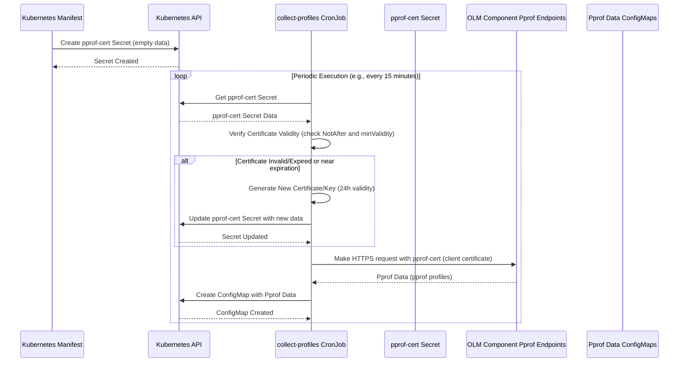

# pprof-cert Secret 管理分析

本文档分析了 `operator-framework-olm` 项目中 `pprof-cert` Secret 的管理、创建、更新、使用场景和过期时间。

`pprof-cert` Secret 是一个 Kubernetes TLS Secret，被 `collect-profiles` CronJob 用作客户端证书，用于在通过 HTTPS 从 OLM 组件的 pprof 端点收集性能分析数据时进行身份验证。

## Secret 的创建与更新

Secret 资源最初是通过应用 Kubernetes Manifest 文件 `manifests/0000_50_olm_00-pprof-secret.yaml` 创建的。此 Manifest 定义了 Secret 的元数据和类型 (`kubernetes.io/tls`)，但 `tls.crt` 和 `tls.key` 数据字段为空。

```yaml
apiVersion: v1
kind: Secret
metadata:
  # ... annotations ...
  name: pprof-cert
  namespace: openshift-operator-lifecycle-manager
type: kubernetes.io/tls
data:
  tls.crt: ""
  tls.key: ""
```

证书和密钥数据由作为 CronJob 运行的 `collect-profiles` 命令负责填充和更新到现有的 `pprof-cert` Secret 中。`cmd/collect-profiles/main.go` 文件中的 `populateServingCert` 函数负责此操作：它获取现有的 Secret，生成新的自签名证书和密钥对，并使用新数据更新 Secret。

```go
// cmd/collect-profiles/main.go
func populateServingCert(ctx context.Context, client client.Client) (*tls.Certificate, error) {
	secret := &corev1.Secret{}
	err := client.Get(ctx, types.NamespacedName{Namespace: namespace, Name: pprofSecretName}, secret)
	// ... error handling ...

	certPEMBytes, privKeyPEMBytes, err := generateCertAndKey()
	// ... error handling ...

	secret.Data[corev1.TLSCertKey] = certPEMBytes
	secret.Data[corev1.TLSPrivateKeyKey] = privKeyPEMBytes

	if err = client.Update(ctx, secret); err != nil {
		return nil, err
	}
	// ...
}
```

## 证书/密钥的生成

`cmd/collect-profiles/main.go` 文件中的 `generateCertAndKey` 函数负责创建新的自签名 TLS 证书和 RSA 私钥。

```go
// cmd/collect-profiles/main.go
func generateCertAndKey() ([]byte, []byte, error) {
	now := time.Now()
	cert := &x509.Certificate{
		SerialNumber: big.NewInt(1658),
		Subject: pkix.Name{
			Organization: []string{"Red Hat, Inc."},
		},
		NotBefore:   now,
		NotAfter:    now.Add(validity), // 证书有效期
		ExtKeyUsage: []x509.ExtKeyUsage{x509.ExtKeyUsageClientAuth},
		KeyUsage:    x509.KeyUsageDigitalSignature,
	}

	keyPair, err := rsa.GenerateKey(rand.Reader, 4096)
	// ... error handling ...

	// 生成 DER 编码的自签名证书
	certDER, err := x509.CreateCertificate(rand.Reader, cert, cert, &keyPair.PublicKey, keyPair)
	// ... error handling ...

	certPEM := new(bytes.Buffer)
	pem.Encode(certPEM, &pem.Block{
		Type:  "CERTIFICATE",
		Bytes: certDER,
	})

	privKeyPEM := new(bytes.Buffer)
	pem.Encode(privKeyPEM, &pem.Block{
		Type:  "RSA PRIVATE KEY",
		Bytes: x509.MarshalPKCS1PrivateKey(keyPair),
	})

	return certPEM.Bytes(), privKeyPEM.Bytes(), nil
}
```

此函数设置了证书的主题、有效期和密钥用途。

## 使用场景

`pprof-cert` Secret 被 `collect-profiles` 命令用作客户端证书，用于在通过 HTTPS 请求 OLM 组件的 pprof 端点时进行身份验证。`verifyCertAndKey` 函数在发出请求之前检查现有证书的有效性，如果需要，会调用 `populateServingCert` 函数生成新的证书。`httpClient` 被配置为使用此证书。

```go
// cmd/collect-profiles/main.go
			httpClient := &http.Client{
				Transport: &http.Transport{
					TLSClientConfig: &tls.Config{
						InsecureSkipVerify: true, // 注意：InsecureSkipVerify 设置为 true
						Certificates:       []tls.Certificate{*tlsCert},
					},
				},
			}
// ...
			for _, a := range validatedArguments {
				b, err := requestURLBody(httpClient, a.url)
				// ...
            }
```
**注意：** `InsecureSkipVerify: true` 设置意味着客户端不会验证服务器的证书链和主机名。这通常用于内部或受控环境，其中使用双向 TLS 进行身份验证，而不是依赖服务器证书来建立信任。

`collect-profiles` 命令遍历提供的 pprof URL，并使用此客户端获取数据。

## 过期时间

生成的证书的有效期为 24 小时，由 `validity` 常量定义：

```go
// cmd/collect-profiles/main.go
const (
	// ...
	validity                 = 24 * time.Hour
	minValidity              = 15 * time.Minute
)
```

`verifyCertAndKey` 函数检查证书是否过期或即将过期（在 `minValidity`，即 15 分钟内）：

```go
// cmd/collect-profiles/main.go
func verifyCertAndKey(certPath, keyPath string) (*tls.Certificate, error) {
    // ... 文件存在性检查 ...
    // ... LoadX509KeyPair ...
    // ... ParseCertificate ...

	now := time.Now()
	if x509Cert.NotAfter.Before(now) {
		return nil, fmt.Errorf("certificate has expired")
	}
	// 由于此 cron 每 15 分钟运行一次，我们假设作业耗时少于 15 分钟，
	// 因此请确保剩余有效期至少为 15 分钟
	if x509Cert.NotAfter.Before(now.Add(minValidity)) {
		return nil, fmt.Errorf("certificate expires in less than 15 minutes")
	}
    // ...
}
```

如果证书过期或即将过期，将调用 `populateServingCert` 生成新证书并更新 Secret。这确保了 `collect-profiles` 作业始终使用有效的证书。

## 总结

`pprof-cert` Secret 是性能分析基础设施的关键部分，用于安全地收集 OLM 组件的性能数据。其生命周期包括通过 Manifest 进行初始创建，以及由 `collect-profiles` CronJob 动态填充和轮换证书和密钥。

以下是 `pprof-cert` Secret 管理和使用过程的 Mermaid 时序图：

